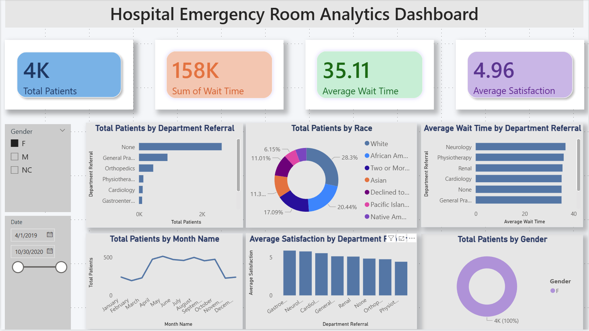
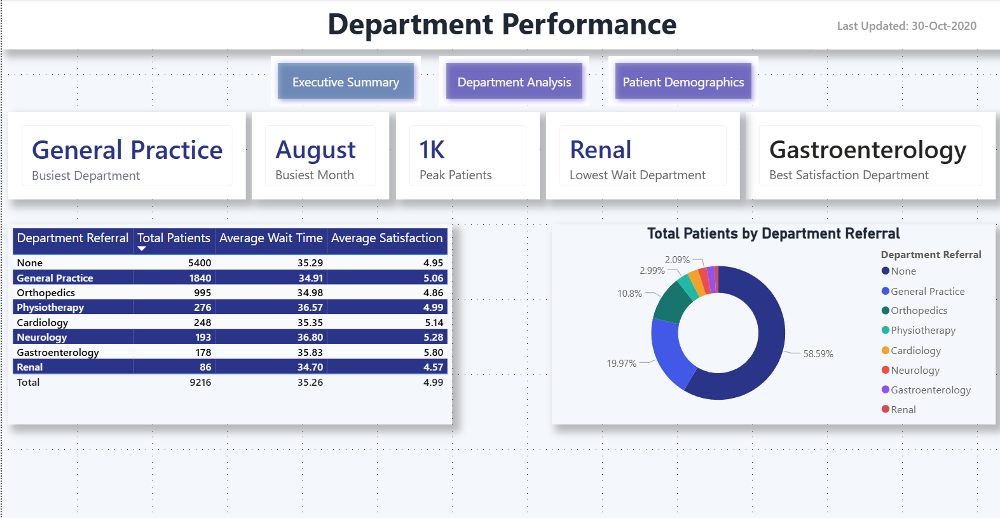
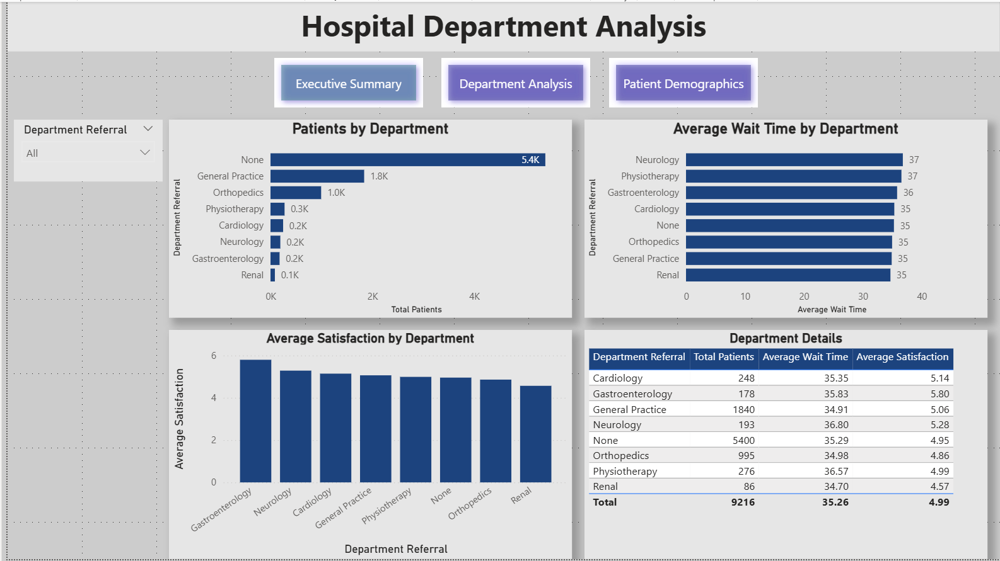
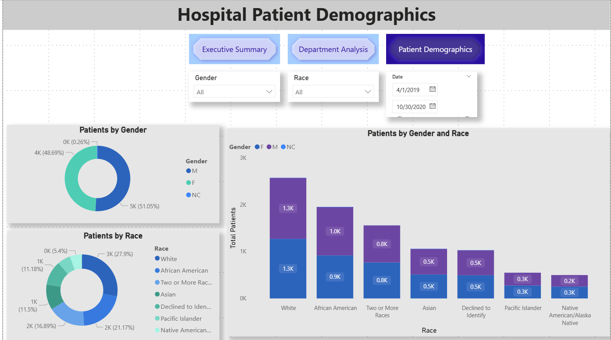

# 🏥 Hospital Executive Summary Dashboard

An interactive Hospital Analytics Dashboard built using **Power BI** to monitor hospital performance, patient demographics, department performance, waiting time, and patient satisfaction.

---

# 📊 Dashboard Preview

## Dashboard

## Executive Summary

## Department Analysis

## Patient Demographics

---

# 📈 Key KPIs

- Total Patients
- Peak Patients
- Busiest Department
- Busiest Month
- Lowest Wait Department
- Best Satisfaction Department
- Average Wait Time
- Average Satisfaction

---

# 📊 Dashboard Features

- Executive Summary Dashboard
- Department Performance Analysis
- Patient Demographics Analysis
- Interactive Navigation Buttons
- Dynamic Slicers
- Drill-down Analysis
- Cross Filtering
- Clean & Professional UI

---

# 🛠 Tools & Technologies

- Power BI Desktop
- Power Query
- DAX
- CSV Dataset
- Data Modeling

---

# 📂 Project Files

- `hospital_data_analysis.pbix`
- `Hospital ER.csv`

---

# 🚀 Skills Demonstrated

- Data Cleaning
- Data Modeling
- Dashboard Design
- Data Visualization
- DAX Measures
- Power Query
- Business Intelligence
- Interactive Reporting

---

# 👨‍💻 Author

**Basit Hussain**

Aspiring Data Analyst

GitHub:
https://github.com/Basit52692
